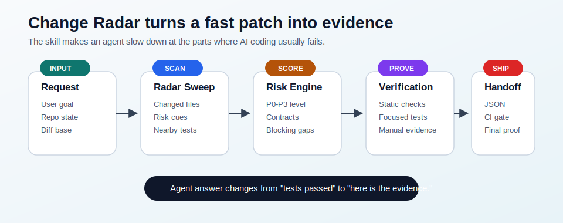
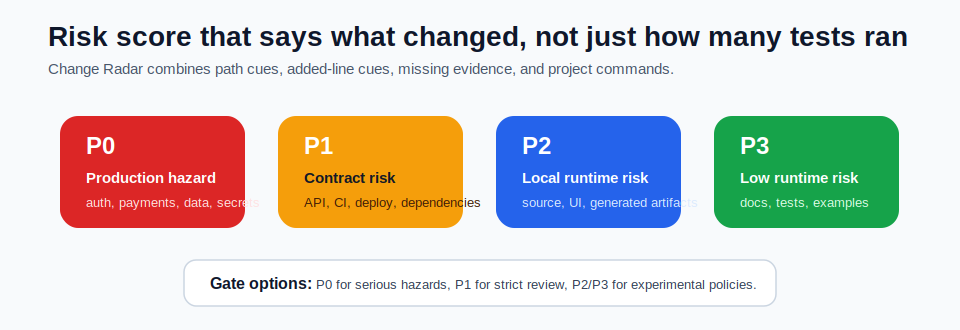
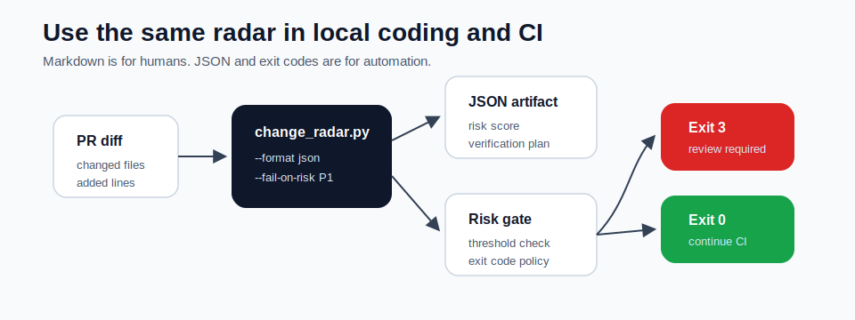

# Change Radar

Change Radar is a Codex skill and dependency-free scanner for safer AI-assisted coding. It makes an agent map the blast radius, risk score, touched contracts, hidden risk, test plan, CI gate, and verification evidence before it changes code or claims that work is done.

AI coding is fast. Change Radar is the seatbelt.

## Visual Overview

<p align="center">
  
</p>

<p align="center">
  
</p>

<p align="center">
  
</p>

Editable Mermaid sources live in [docs/diagrams](docs/diagrams).

## Why This Matters

Modern coding agents are very good at producing patches, but the expensive failures usually happen around the patch: missed contracts, weak test selection, accidental scope drift, migrations, auth paths, deployment files, generated artifacts, and vague final answers.

Change Radar gives the agent a repeatable engineering ritual:

- Build a concise change brief.
- Sweep the repository for changed files, project signals, risk cues, and missing-test gaps.
- Score the change as P0/P1/P2/P3 with a normalized risk score.
- Map affected contracts.
- Select tests that actually prove the change, grouped by static/focused/broad/manual checks.
- Emit JSON or fail CI when a change crosses a configured risk threshold.
- Audit completion requirement by requirement.

## Install

Clone the repository and copy the skill folder into your Codex skills directory:

```bash
git clone https://github.com/YfengJ/change-radar.git
cp -R change-radar/change-radar ~/.codex/skills/
```

Restart Codex if your environment does not hot-load new skills.

## Use

Invoke the skill explicitly when starting non-trivial code work:

```text
Use $change-radar to implement this API change safely.
```

Or:

```text
Use $change-radar to review this diff and tell me what tests actually matter.
```

## What Is Inside

```text
change-radar/
├── SKILL.md
├── agents/openai.yaml
├── scripts/change_radar.py
└── references/
    ├── ci-usage.md
    ├── risk-taxonomy.md
    └── test-selection.md
```

The bundled scanner is dependency-free Python:

```bash
python3 change-radar/scripts/change_radar.py --repo /path/to/project
```

It can also emit JSON for automation:

```bash
python3 change-radar/scripts/change_radar.py --repo /path/to/project --format json
```

And it can act as a CI gate:

```bash
python3 change-radar/scripts/change_radar.py --repo /path/to/project --fail-on-risk P1
```

It reports:

- Changed files from git diff, staged changes, and untracked files.
- Common project manifests.
- P0/P1/P2/P3 risk level and 0-100 risk score.
- Risk cues for dependencies, CI, migrations, auth, APIs, executable source, UI, generated files, docs, and high-signal diff content.
- Added-line detection for possible secrets, focused tests, skipped tests, and TODO markers.
- Inferred contract map and concrete recommended actions.
- Nearby test files by naming convention.
- Blocking evidence gaps such as changed production files without nearby tests.
- Suggested verification commands from project manifests, grouped by purpose.

See [examples/change-radar-report.md](examples/change-radar-report.md) and [examples/change-radar-report.json](examples/change-radar-report.json) for sample output.

See [change-radar/references/ci-usage.md](change-radar/references/ci-usage.md) for GitHub Actions usage.

For safe fixtures that intentionally contain detector examples, add `change-radar: ignore-risk` on the same added line. Use this sparingly; the scanner treats it as an explicit reviewer-facing assertion that the line is safe.

## Good Fit

Use Change Radar for:

- Feature implementation.
- Bug fixes.
- Refactors.
- Pull request review.
- CI failure fixes.
- Migration, auth, payment, API, or deployment changes.
- Any moment where "tests passed" is too vague to be trustworthy.

## Not A Replacement For Judgment

The scanner is deliberately heuristic. Its job is to wake the agent up, not to decide for it. The skill tells the agent to label inferred contracts, resolve or acknowledge blocking gaps, choose verification based on actual risk, and be honest when evidence is missing.

## License

MIT
